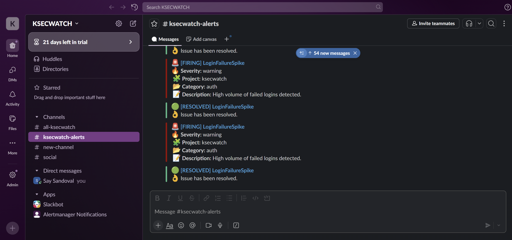
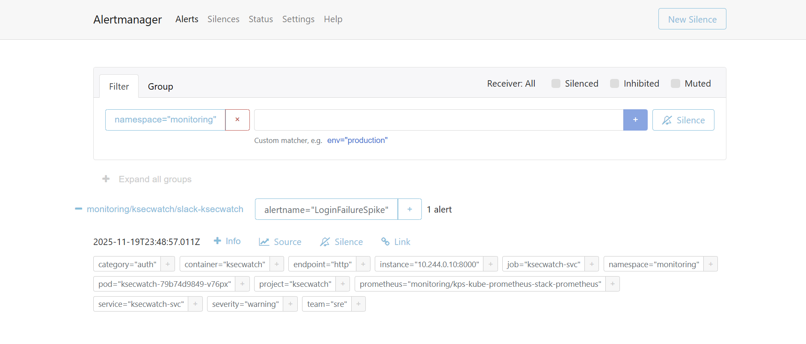
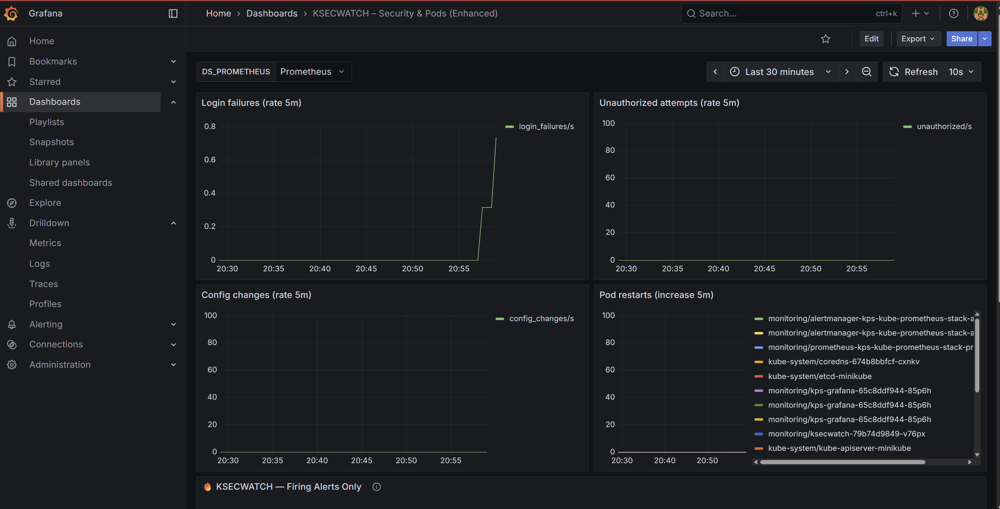
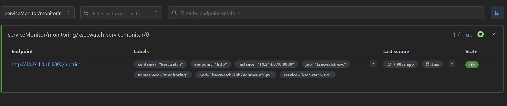

# 🚀 KSECWATCH – Security & Pod Monitoring for Kubernetes  
Full Observability Stack: Minikube + Prometheus Operator + Grafana + Alertmanager + Slack

KSECWATCH is a security-focused monitoring application built with **Python/Flask**, exposing custom Prometheus metrics and deployed on Kubernetes.  
The project includes a complete observability pipeline with:

- Prometheus (metrics scraping)
- Alertmanager (Slack alerts with emojis)
- Grafana (dashboards)
- Custom PrometheusRules (security & pod alerts)
- ServiceMonitor (Prometheus Operator)
- Secure Slack secret (not stored in repo)
- Minikube deployment

---

# 📂 Repository Structure
```text
.
├── application
│   ├── main.py
│   └── requirements.txt
│
├── kubernetes
│   ├── deployment.yaml
│   ├── service.yaml
│   ├── ksecwatch-servicemonitor.yaml
│   ├── security-alerts.yaml
│   ├── pod-changes-alerts.yaml
│   └── alertmanagerconfig-ksecwatch.yaml
│
├── dashboards
│   └── security-pod-dashboard.json
│
├── screenshots
│   ├── slack.png
│   ├── alertmanager.png
│   ├── grafana.png
│   └── prometheus.png
│
├── Dockerfile
├── LICENSE
├── .gitignore
├── README.md
└── CONTRIBUTING.md
```
---

# ⚙️ Requirements

- Minikube (Docker driver)
- Docker
- Helm 3
- kubectl
- Python 3.9+
- Slack Webhook URL

---

# 🧹 1. Wipe Environment (Clean Start)

minikube delete --all --purge <br>
docker system prune -af --volumes <br>
rm -rf ~/.kube ~/.minikube

---

# 🚀 2. Start Minikube

minikube start --driver=docker --memory=4096 --cpus=2 <br>
kubectl create namespace monitoring <br>

---

# 📦 3. Build & Load Docker Image

docker build -t ksecwatch-app:0.1 <br>
minikube image load ksecwatch-app:0.1 <br>

---

# 📥 4. Install kube-prometheus-stack (with Grafana password)

helm repo add prometheus-community https://prometheus-community.github.io/helm-charts <br>
helm repo update <br>

helm install kps prometheus-community/kube-prometheus-stack  <br>
  --namespace monitoring  <br>
  --set grafana.adminPassword="NuevaPass123!"  <br>
  --set grafana.service.type=ClusterIP  <br>
  --set prometheus.prometheusSpec.serviceMonitorSelectorNilUsesHelmValues=false  <br>
  --set prometheus.prometheusSpec.ruleSelectorNilUsesHelmValues=false

---

# 🔐 5. Create Secure Slack Secret

kubectl create secret generic slack-webhook  <br>
  --from-literal=url="https://hooks.slack.com/services/XXX/YYY/ZZZ"  <br>
  -n monitoring

---

# 🚀 6. Deploy KSECWATCH & Monitoring Rules

kubectl apply -f kubernetes/deployment.yaml <br>
kubectl apply -f kubernetes/service.yaml <br>
kubectl apply -f kubernetes/ksecwatch-servicemonitor.yaml <br>
kubectl apply -f kubernetes/security-alerts.yaml <br>
kubectl apply -f kubernetes/pod-changes-alerts.yaml <br>
kubectl apply -f kubernetes/alertmanagerconfig-ksecwatch.yaml <br>

---

# 📡 7. Access UIs

Prometheus
kubectl port-forward svc/kps-kube-prometheus-stack-prometheus -n monitoring 9091:9090 <br>
http://localhost:9091 <br>

Alertmanager <br>
kubectl port-forward svc/kps-kube-prometheus-stack-alertmanager -n monitoring 9003:9093 <br>
http://localhost:9003

Grafana <br>
kubectl port-forward svc/kps-grafana -n monitoring 3001:80 <br>
http://localhost:3001 <br>
Login: <br>
admin / NuevaPass123!

---

# 📊 8. Import Dashboard

Upload this file in Grafana: <br>
dashboards/security-pod-dashboard.json

---

# 🧪 9. Testing

Trigger metrics <br>
kubectl port-forward deploy/ksecwatch -n monitoring 8000:8000 <br>
curl localhost:8000/login-fail <br>
curl localhost:8000/unauthorized <br>
curl localhost:8000/config-change <br>

Generate alert spike <br>
for i in {1..15}; do curl localhost:8000/login-fail; done

---

# 🛎️ 10. Slack Notifications

🔥 FIRING Example

🚨 **[FIRING] LoginFailureSpike**  
🔥 **Severity:** warning  
🧩 **Project:** ksecwatch  
📂 **Category:** auth  
📝 **Description:** High volume of failed logins detected.  

---

🟢 RESOLVED Example

🟢 **[RESOLVED] LoginFailureSpike**  
👌 Issue has been resolved.

---

# 🖼️ 11. Screenshots
- Slack: <br>
 <br>

- Alert manager: <br>
 <br>

- Grafana: <br>
 <br>

- Prometheus: <br>


---

# 🛠️ 12. Troubleshooting

- Pod not scraped <br>
Check matchLabels in ServiceMonitor: <br>
   selector: <br>
  matchLabels: <br>
    app: ksecwatch

- Slack not receiving alerts <br>
Verify secret exists: <br>
kubectl get secret slack-webhook -n monitoring -o yaml 

- Dashboard shows no alerts <br>
PromQL query must include: <br>
ALERTS{alertstate="firing"}

---

# 13. 🎉 KSECWATCH Completed!


